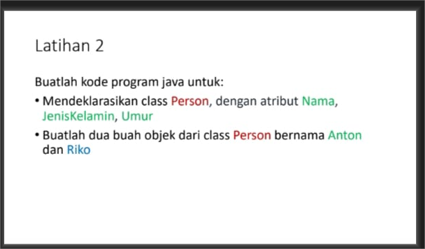
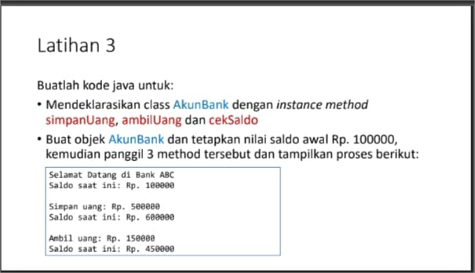

# Tugas-2

|Nama|NIM|Kelas|Mata Kuliah|
|----|---|-----|------|
|**Bagas Prihantoro Putra**|**312310599**|**TI.23.A6**|**Pemrograman Orientasi Objek**|

# Kode Input Latihan 2

   public class Person {
    private String nama;
    private String jenisKelamin; 
    private int umur;

    public Person(String nama, String jenisKelamin, int umur) {
        this.nama = nama;
        this.jenisKelamin = jenisKelamin;
        this.umur = umur;
    }

    public String getNama() {
        return nama;
    }

    public void setNama(String nama) {
        this.nama = nama;
    }

    public String getJenisKelamin() {
        return jenisKelamin;
    }

    public void setJenisKelamin(String jenisKelamin) {
        this.jenisKelamin = jenisKelamin;
    }

    public int getUmur() {
        return umur;
    }

    public void setUmur(int umur) {
        this.umur = umur;
    }

    public static void main(String[] args) {
        Person Anton = new Person("Anton", "Laki-laki", 25);
        Person Riko = new Person("Riko", "Laki-laki", 30);

        System.out.println("Nama Anton: " + Anton.getNama());
        System.out.println("Jenis Kelamin Anton: " + Anton.getJenisKelamin());
        System.out.println("Umur Anton: " + Anton.getUmur());

        System.out.println("Nama Riko: " + Riko.getNama());
        System.out.println("Jenis Kelamin Riko: " + Riko.getJenisKelamin());
        System.out.println("Umur Riko: " + Riko.getUmur());
    }
}

